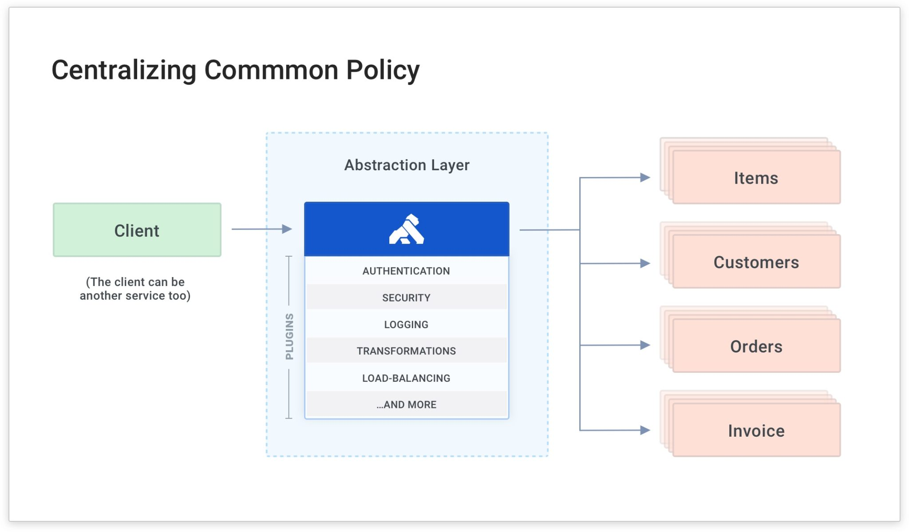
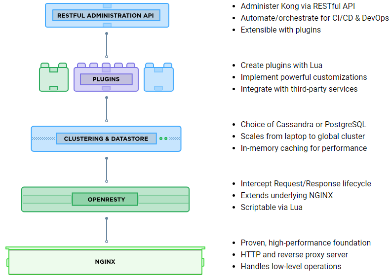
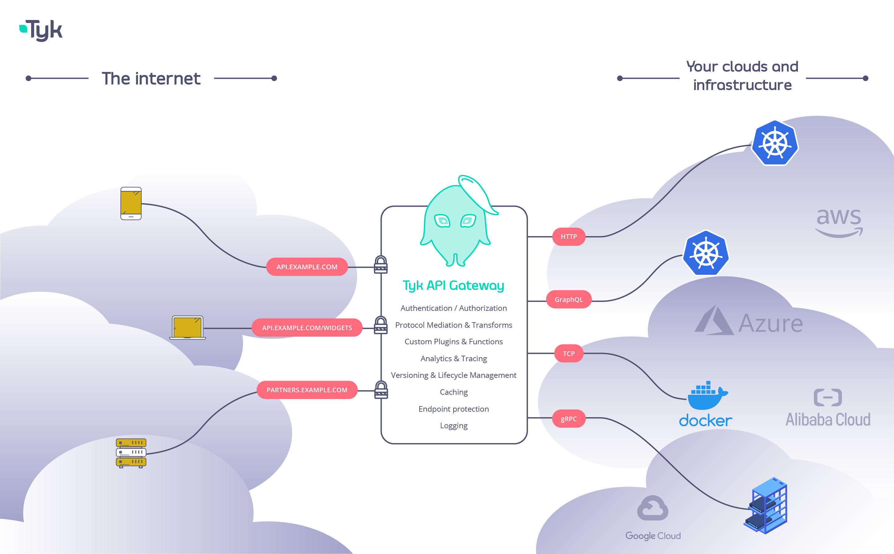
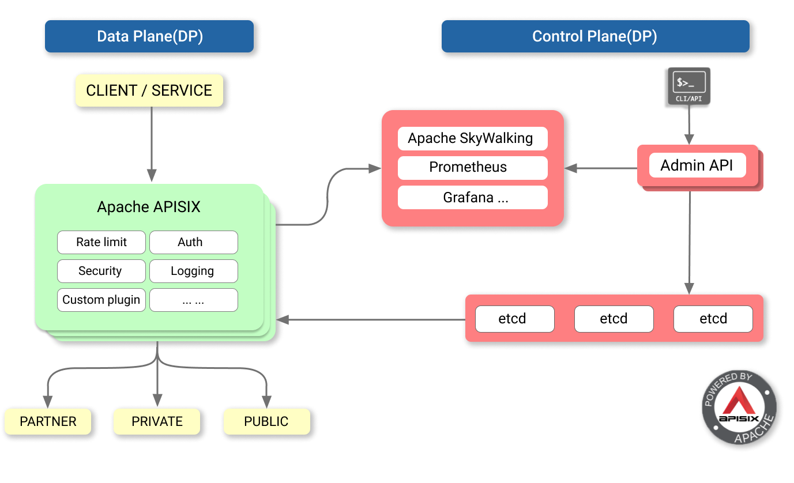
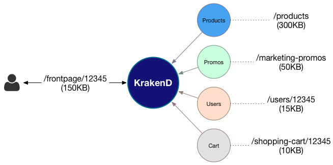

# API Gateway (Backends for Frontends)

### Defintion and generalities

An API Gateway is a service that provides a single-entry point for certain groups of microservices.
The API Gateway encapsulates the internal system architecture and provides an API that is tailored to each client, independent of the number and composition of internal microservices.
It might have other responsibilities such as authentication, monitoring, load balancing, caching, request shaping and management, and static response handling.
The API gateway handles some requests by simply routing them to the appropriate backend service, and handles others by invoking multiple backend services and aggregating the results.

 
    

#### Features

Reverse proxy or gateway routing. The API Gateway offers a reverse proxy to redirect or route requests (layer 7 routing, usually HTTP requests) to the endpoints of the internal microservices. The gateway provides a single endpoint or URL for the client apps and then internally maps the requests to a group of internal microservices.

 
    

### Benefits

- **Ease of Development**: An API Gateway abstracts knowledge about your sub-domains on the back-end and client-side developers can develop against a single entry point. It makes it easy for them to consume the REST APIs to implement front-end apps.
- **Faster Communication Between Front-end and Back-end:** Front-end applications can now communicate with a single point of contact (API gateway). This improves the speed of communication between the client and servers. This speed gain proves more valuable for cross-continental communications (eg. EU-based servers and asia-based clients) as they reduce the latency required for performing communication as compared to having several point of contacts.
- **Coupling:** Without the API Gateway pattern, the client apps are coupled to the internal microservices. The client apps need to know how the multiple areas of the application are decomposed in microservices. When evolving and refactoring the internal microservices, those actions impact maintenance because they cause breaking changes to the client apps due to the direct reference to the internal microservices from the client apps. Client apps need to be updated frequently, making the solution harder to evolve.
- **Too Many Round Trips:** A single page/screen in the client app might require several calls to multiple services. That approach can result in multiple network round trips between the client and the server, adding significant latency. Aggregation handled in an intermediate level could improve the performance and user experience for the client app.
- **Security Issues:** Without a gateway, all the microservices must be exposed to the "external world", making the attack surface larger than if you hide internal microservices that aren't directly used by the client apps. The smaller the attack surface is, the more secure your application can be.
- **Cross-cutting Concerns:** Each publicly published microservice must handle concerns such as authorization and SSL. In many situations, those concerns could be handled in a single tier so the internal microservices are simplified and the solutions are cheaper and more reliable.

### Drawbacks

- It introduces additional costs (the API Gateway must be developed, deployed, and managed).
- There is a risk that the API Gateway becomes a development bottleneck.
- You need a highly matured development team to execute such strategy.

# Popular Implementations

 
    

**[Kong](https://github.com/Kong/kong)** is a cloud-native, fast, scalable, and distributed Microservice Abstraction Layer (also known as an API Gateway or API Middleware).

- **Lua**
- **28.7k stars**
- **[Lots of plugins available](https://docs.konghq.com/hub/)**

#### Features

 
    

- **Cloud-Native**: Platform agnostic, Kong can run on any platform - from bare
  metal to containers - and it can run on every cloud natively.
- **Kubernetes-Native**: Declaratively configure Kong with native Kubernetes CRDs
  using the official Ingress Controller to route and connect all L4 + L7 traffic.
- **Dynamic Load Balancing**: Load balance traffic across multiple upstream
  services.
- **Hash-based Load Balancing**: Load balance with consistent hashing/sticky
  sessions.
- **Circuit-Breaker**: Intelligent tracking of unhealthy upstream services.
- **Health Checks:** Active and passive monitoring of your upstream services.
- **Service Discovery**: Resolve SRV records in third-party DNS resolvers like
  Consul.
- **Serverless**: Invoke and secure AWS Lambda or OpenWhisk functions directly
  from Kong.
- **WebSockets**: Communicate to your upstream services via WebSockets.
- **gRPC**: Communicate to your gRPC services and observe your traffic with logging
  and observability plugins
- **OAuth2.0**: Easily add OAuth2.0 authentication to your APIs.
- **Logging**: Log requests and responses to your system over HTTP, TCP, UDP,
  or to disk.
- **Security**: ACL, Bot detection, allow/deny IPs, etc...
- **Syslog**: Logging to System log.
- **SSL**: Setup a Specific SSL Certificate for an underlying service or API.
- **Monitoring**: Live monitoring provides key load and performance server
  metrics.
- **Forward Proxy**: Make Kong connect to intermediary transparent HTTP proxies.
- **Authentications**: HMAC, JWT, Basic, and more.
- **Rate-limiting**: Block and throttle requests based on many variables.
- **Transformations**: Add, remove, or manipulate HTTP requests and responses.
- **Caching**: Cache and serve responses at the proxy layer.
- **CLI**: Control your Kong cluster from the command line.
- **REST API**: Kong can be operated with its RESTful API for maximum
  flexibility.
- **Geo-Replicated**: Configs are always up-to-date across different regions.
- **Failure Detection & Recovery**: Kong is unaffected if one of your Cassandra
  nodes goes down.
- **Clustering**: All Kong nodes auto-join the cluster keeping their config
  updated across nodes.
- **Scalability**: Distributed by nature, Kong scales horizontally by simply
  adding nodes.
- **Performance**: Kong handles load with ease by scaling and using NGINX at
  the core.
- **Plugins**: Extendable architecture for adding functionality to Kong and
  APIs.

 
    

### Distributions

- [Kubernetes Ingress Controller for Kong](https://github.com/Kong/kubernetes-ingress-controller):
  Use Kong for Kubernetes Ingress.
- [Kong Docker](https://github.com/Kong/docker-kong): A Dockerfile for
  running Kong in Docker.
- [Kong Packages](https://github.com/Kong/kong/releases): Pre-built packages
  for Debian, Red Hat, and OS X distributions (shipped with each release).
- [Kong CloudFormation](https://github.com/Kong/kong-dist-cloudformation):
  Kong in a 1-click deployment for AWS EC2.
- [Kong AWS AMI](https://aws.amazon.com/marketplace/pp/B06WP4TNKL): Kong AMI on
  the AWS Marketplace.
- [Kong on Microsoft Azure](https://github.com/Kong/kong-dist-azure): Run Kong
  using Azure Resource Manager.
- [Kong on Heroku](https://github.com/heroku/heroku-kong): Deploy Kong on
  Heroku in one click.
- [Master Builds](https://hub.docker.com/r/kong/kong/tags): Docker images for each commit in the `master` branch.

---

 
    

**[Zuul](https://github.com/Netflix/zuul)** is an L7 application gateway that provides capabilities for dynamic routing, monitoring, resiliency, security, and more.

- **Java**
- **10.8k stars**
- **Backed by Netflix**

#### Features

- **Authentication and Security**: Identifying authentication requirements for each resource and rejecting requests that do not satisfy them.
- **Insights and Monitoring**: Tracking meaningful data and statistics at the edge in order to give us an accurate view of production.
- **Dynamic Routing**: Dynamically routing requests to different backend clusters as needed.
- **Stress Testing**: Gradually increasing the traffic to a cluster in order to gauge performance.
- **Load Shedding**: Allocating capacity for each type of request and dropping requests that go over the limit.
- **Static Response handling**: Building some responses directly at the edge instead of forwarding them to an internal cluster
- **Multiregion Resiliency**: Routing requests across AWS regions in order to diversify our ELB usage and move our edge closer to our members

 
    

---

 
    

**[Tyk](https://github.com/TykTechnologies/tyk)** is an open Source API Gateway written in Go, supporting REST, GraphQL, TCP and gRPC protocols.

- **Go**
- **6.2k stars**
- **[Some plugins available](https://tyk.io/features/extend-tyk/)**

#### Features

- **Industry Standard Authentication**: OIDC, JWT, bearer Tokens, Basic Auth, Client Certificates and more.
- **Open API Standards**: Import your Swagger and OAS2/3 documents to scaffold APIs in Tyk.
- **Ultra performant:** Low latency, and thousands of rps with just a single CPU, horizontally and vertically scalable.
- **Content mediation**: Transform all the things, from request or response headers to converting between SOAP and GraphQL.
- **Extensible Plugin Architecture**: Customize Tyk’s middleware chain by writing plugins in your language of choice - from Python to Javascript to Go, or any language which supports gRPC.
- **Rate Limiting & Quotas:** Protect your upstreams from becoming overloaded and/or apply limits for each consumer.
- **API Versioning** - API Versions can be easily set and deprecated at a specific time and date.
- **Granular Access Control** - Grant access to one or more APIs on a per version and operation basis.
- **Blocklist/Allowlist/Ignored endpoint access** - Enforce strict security models on a version-by-version basis to your access points.
- **Analytics logging** - Record detailed usage data on who is using your API's (raw data only)
- **CORS** - Enable [CORS](https://tyk.io/docs/tyk-apis/tyk-gateway-api/api-definition-objects/cors/) for certain APIs so users can make browser-based requests
- **Webhooks** - Trigger webhooks against events such as Quota Violations and Authentication failures
- **IP AllowListing** - Block access to non-trusted IP addresses for more secure interactions
- **Hitless reloads** - Tyk configurations can be altered dynamically and the service restarted without affecting any active request
- **Kubernetes native declarative API:** using Open Source [Tyk Operator](https://github.com/TykTechnologies/tyk-operator) (more info in OSS section)

 
    

### Distributions

- [Docker](https://tyk.io/docs/tyk-oss/ce-docker/) (Recommended method)
- [ Kubernetes-Native ](https://github.com/TykTechnologies/tyk-oss-k8s-deployment)
- [Kubernetes-Helm](https://github.com/TykTechnologies/tyk-helm-chart#install-tyk-community-edition)
- [Ansible](https://tyk.io/docs/tyk-oss/ce-ansible/)
- [Red Hat](https://tyk.io/docs/tyk-oss/ce-redhat/)
- [Ubuntu](https://tyk.io/docs/tyk-oss/ce-ubuntu/)
- [CentOS](https://tyk.io/docs/tyk-oss/ce-centos/)

---

 
    

[Apache Apisix](https://github.com/apache/apisix) is a dynamic, real-time, high-performance API gateway.
APISIX provides rich traffic management features such as load balancing, dynamic upstream, canary release, circuit breaking, authentication, observability, and more.
You can use Apache APISIX to handle traditional north-south traffic, as well as east-west traffic between services. It can also be used as a k8s ingress controller.

- **Lua**
- **4.8k stars**

 
    

### Features

You can use Apache APISIX as a traffic entrance to process all business data, including dynamic routing, dynamic upstream, dynamic certificates,
A/B testing, canary release, blue-green deployment, limit rate, defense against malicious attacks, metrics, monitoring alarms, service observability, service governance, etc.

- **All platforms**

  - Cloud-Native: Platform agnostic, No vendor lock-in, APISIX can run from bare-metal to Kubernetes.
  - Run Environment: Both OpenResty and Tengine are supported.
  - Supports ARM64: Don't worry about the lock-in of the infra technology.

- **Multi protocols**

  - [TCP/UDP Proxy](docs/en/latest/stream-proxy.md): Dynamic TCP/UDP proxy.
  - [Dubbo Proxy](docs/en/latest/plugins/dubbo-proxy.md): Dynamic HTTP to Dubbo proxy.
  - [Dynamic MQTT Proxy](docs/en/latest/plugins/mqtt-proxy.md): Supports to load balance MQTT by `client_id`, both support MQTT [3.1.\*](http://docs.oasis-open.org/mqtt/mqtt/v3.1.1/os/mqtt-v3.1.1-os.html), [5.0](https://docs.oasis-open.org/mqtt/mqtt/v5.0/mqtt-v5.0.html).
  - [gRPC proxy](docs/en/latest/grpc-proxy.md): Proxying gRPC traffic.
  - [gRPC transcoding](docs/en/latest/plugins/grpc-transcode.md): Supports protocol transcoding so that clients can access your gRPC API by using HTTP/JSON.
  - Proxy Websocket
  - Proxy Protocol
  - Proxy Dubbo: Dubbo Proxy based on Tengine.
  - HTTP(S) Forward Proxy
  - [SSL](docs/en/latest/https.md): Dynamically load an SSL certificate.

- **Full Dynamic**

  - [Hot Updates And Hot Plugins](docs/en/latest/plugins.md): Continuously updates its configurations and plugins without restarts!
  - [Proxy Rewrite](docs/en/latest/plugins/proxy-rewrite.md): Support rewrite the `host`, `uri`, `schema`, `enable_websocket`, `headers` of the request before send to upstream.
  - [Response Rewrite](docs/en/latest/plugins/response-rewrite.md): Set customized response status code, body and header to the client.
  - [Serverless](docs/en/latest/plugins/serverless.md): Invoke functions in each phase in APISIX.
  - Dynamic Load Balancing: Round-robin load balancing with weight.
  - Hash-based Load Balancing: Load balance with consistent hashing sessions.
  - [Health Checks](docs/en/latest/health-check.md): Enable health check on the upstream node and will automatically filter unhealthy nodes during load balancing to ensure system stability.
  - Circuit-Breaker: Intelligent tracking of unhealthy upstream services.
  - [Proxy Mirror](docs/en/latest/plugins/proxy-mirror.md): Provides the ability to mirror client requests.
  - [Traffic Split](docs/en/latest/plugins/traffic-split.md): Allows users to incrementally direct percentages of traffic between various upstreams.

- **Fine-grained routing**

  - [Supports full path matching and prefix matching](docs/en/latest/router-radixtree.md#how-to-use-libradixtree-in-apisix)
  - [Support all Nginx built-in variables as conditions for routing](docs/en/latest/router-radixtree.md#how-to-filter-route-by-nginx-builtin-variable), so you can use `cookie`, `args`, etc. as routing conditions to implement canary release, A/B testing, etc.
  - Support [various operators as judgment conditions for routing](https://github.com/iresty/lua-resty-radixtree#operator-list), for example `{"arg_age", ">", 24}`
  - Support [custom route matching function](https://github.com/iresty/lua-resty-radixtree/blob/master/t/filter-fun.t#L10)
  - IPv6: Use IPv6 to match the route.
  - Support [TTL](docs/en/latest/admin-api.md#route)
  - [Support priority](docs/en/latest/router-radixtree.md#3-match-priority)
  - [Support Batch Http Requests](docs/en/latest/plugins/batch-requests.md)

- **Security**

  - Authentications: [key-auth](docs/en/latest/plugins/key-auth.md), [JWT](docs/en/latest/plugins/jwt-auth.md), [basic-auth](docs/en/latest/plugins/basic-auth.md), [wolf-rbac](docs/en/latest/plugins/wolf-rbac.md)
  - [IP Whitelist/Blacklist](docs/en/latest/plugins/ip-restriction.md)
  - [Referer Whitelist/Blacklist](docs/en/latest/plugins/referer-restriction.md)
  - [IdP](docs/en/latest/plugins/openid-connect.md): Support external authentication services, such as Auth0, okta, etc., users can use this to connect to OAuth 2.0 and other authentication methods.
  - [Limit-req](docs/en/latest/plugins/limit-req.md)
  - [Limit-count](docs/en/latest/plugins/limit-count.md)
  - [Limit-concurrency](docs/en/latest/plugins/limit-conn.md)
  - Anti-ReDoS(Regular expression Denial of Service): Built-in policies to Anti ReDoS without configuration.
  - [CORS](docs/en/latest/plugins/cors.md) Enable CORS(Cross-origin resource sharing) for your API.
  - [URI Blocker](docs/en/latest/plugins/uri-blocker.md): Block client request by URI.
  - [Request Validator](docs/en/latest/plugins/request-validation.md)

- **OPS friendly**

  - OpenTracing: support [Apache Skywalking](docs/en/latest/plugins/skywalking.md) and [Zipkin](docs/en/latest/plugins/zipkin.md)
  - works with external service discovery：In addition to the built-in etcd, it also supports [Consul](docs/en/latest/discovery/consul_kv.md) and [Nacos](docs/en/latest/discovery/nacos.md), and [Eureka](docs/en/latest/discovery.md)
  - Monitoring And Metrics: [Prometheus](docs/en/latest/plugins/prometheus.md)
  - Clustering: APISIX nodes are stateless, creates clustering of the configuration center, please refer to [etcd Clustering Guide](https://etcd.io/docs/v3.4.0/op-guide/clustering/).
  - High availability: Support to configure multiple etcd addresses in the same cluster.
  - [Dashboard](https://github.com/apache/apisix-dashboard)
  - Version Control: Supports rollbacks of operations.
  - CLI: start\stop\reload APISIX through the command line.
  - [Stand-Alone](docs/en/latest/stand-alone.md): Supports to load route rules from local YAML file, it is more friendly such as under the kubernetes(k8s).
  - [Global Rule](docs/en/latest/architecture-design/global-rule.md): Allows to run any plugin for all request, eg: limit rate, IP filter etc.
  - High performance: The single-core QPS reaches 18k with an average delay of fewer than 0.2 milliseconds.
  - [Fault Injection](docs/en/latest/plugins/fault-injection.md)
  - [REST Admin API](docs/en/latest/admin-api.md): Using the REST Admin API to control Apache APISIX, which only allows 127.0.0.1 access by default, you can modify the `allow_admin` field in `conf/config.yaml` to specify a list of IPs that are allowed to call the Admin API. Also, note that the Admin API uses key auth to verify the identity of the caller. **The `admin_key` field in `conf/config.yaml` needs to be modified before deployment to ensure security**.
  - External Loggers: Export access logs to external log management tools. ([HTTP Logger](docs/en/latest/plugins/http-logger.md), [TCP Logger](docs/en/latest/plugins/tcp-logger.md), [Kafka Logger](docs/en/latest/plugins/kafka-logger.md), [UDP Logger](docs/en/latest/plugins/udp-logger.md))
  - [Helm charts](https://github.com/apache/apisix-helm-chart)

- **Highly scalable**

  - [Custom plugins](docs/en/latest/plugin-develop.md): Allows hooking of common phases, such as `rewrite`, `access`, `header filter`, `body filter` and `log`, also allows to hook the `balancer` stage.
  - Custom load balancing algorithms: You can use custom load balancing algorithms during the `balancer` phase.
  - Custom routing: Support users to implement routing algorithms themselves.

### Distributions

- [Docker](https://hub.docker.com/r/apache/apisix)
- [Linux](https://github.com/apache/apisix#configure-and-installation/)

---

 
    

**[KrakenD](https://github.com/devopsfaith/krakend)** is an open framework to assemble ultra performance API Gateways with middlewares; core service of the KrakenD API Gateway.
**[KrakenD Community Edition ](https://github.com/devopsfaith/krakend-ce)** (or KrakenD-CE) is the binary distribution of KrakenD.

- **Go**
- **3.8k stars**

Its core functionality is to create an API that acts as an aggregator of many microservices into single endpoints, doing the heavy-lifting automatically for you: aggregate, transform, filter, decode, throttle, auth and more.
KrakenD needs no programming as it offers a declarative way to create the endpoints. It is well structured and layered and open to extending its functionality using plug-and-play middleware developed by the community or in-house.

 
    

### Features

Some of the features you get with KrakenD are:

- **Ultra-High performance** API Gateway
- **Backend for Frontend**
- **Efficient**: Super low memory consumption with high traffic (usually under 50MB w/ +1000 concurrent) and even lower with low traffic (under 5MB)
- **Easy to use**: Declaration of endpoints by just writing the `/url/patterns/and/{variables}`
- **Unlimited** number of backends and endpoints associated with each endpoint. The limit is your kernel.
- **Aggregation** of all the data in the backends for a single endpoint
- **Response composition** and data manipulation (capture, groups, renames...)
- **Response filtering** (whitelist and blacklist)
- **Concurrent** API calls to the backend for the same request
- **Simple configuration**: All application configuration and behavior declared in a `krakend.json`.
- **Friendly**: No development needed to build your gateway. Use the Visual API [Designer](http://www.krakend.io/designer/) (UI to generate the `krakend.json`)
- **SSL**
- **HTTP2** ready
- **Circuit breaker** (fail fast and avoid smashing stressed backends)
- **Bursting** on High-load
- **Logging and statistics** of usage
- **API with statistics**
- **Service Discovery**: DNS SRV, ETCD or add your own
- **Multiple encodings** supported (json, XML, RSS or response as single string)
- **Injections via DSL** in the configuration (Martian)
- **Throttling**: Limits of usage in the router and proxy layers.
- **User quota**: Restrict usage of users by IP or custom headers
- **Basic Firewalling**: Restrict connections by host, drop connections on certain limits
- **Automatic load balancing**
- **HTTP Cache** headers
- **In-memory backend response cache**
- Multiple installation options (bin, docker, rpm, deb, brew)
- **Cloud native**
- **Loved by orchestrators** (Kubernetes, Mesos + Marathon, Nomad, Docker Swarm, and others)
- **Secure:**
  - Support for SSL
  - OAuth client grant
  - JSON Web Tokens (JWT) and JSON Object Signing and Encryption (JOSE)
  - HTTP Strict Transport Security (HSTS)
  - Clickjacking protection
  - HTTP Public Key Pinning (HPKP)
  - MIME-Sniffing prevention
  - Cross-site scripting (XSS) protection
  - Cross-origin resource sharing (CORS)

 
    

### Distributions

- [Docker](https://hub.docker.com/r/devopsfaith/krakend/)
- [AWS EC2](https://aws.amazon.com/marketplace/seller-profile?id=0b4c8ac8-584c-406c-9b8d-4c8e3c34b81f)
- [Azure](https://azuremarketplace.microsoft.com/en-us/marketplace/apps/brutale.krakend-ce?tab=Overview)
- [Linux/OS X](https://www.krakend.io/download/)

## Comparaison

### Kong vs Karkend

[read](https://stackoverflow.com/questions/60050154/how-good-is-krakend-compared-to-kong)

### Apache APISIX vs. Kong

#### Both of them have been covered core features of API gateway

| **Features**         | **Apache APISIX** | **KONG** |
| :------------------- | :---------------- | :------- |
| **Dynamic upstream** | Yes               | Yes      |
| **Dynamic router**   | Yes               | Yes      |
| **Health check**     | Yes               | Yes      |
| **Dynamic SSL**      | Yes               | Yes      |
| **L4 and L7 proxy**  | Yes               | Yes      |
| **Opentracing**      | Yes               | Yes      |
| **Custom plugin**    | Yes               | Yes      |
| **REST API**         | Yes               | Yes      |
| **CLI**              | Yes               | Yes      |

#### The advantages of Apache APISIX

| **Features**                                                    | **Apache APISIX**                                                                                                                                                                        | **Kong**                |
| :-------------------------------------------------------------- | :--------------------------------------------------------------------------------------------------------------------------------------------------------------------------------------- | :---------------------- |
| Belongs to                                                      | Apache Software Foundation                                                                                                                                                               | Kong Inc.               |
| Tech Architecture                                               | Nginx + etcd                                                                                                                                                                             | Nginx + Postgres        |
| Communication channels                                          | Mail list, Wechat group, QQ group, [GitHub](https://github.com/apache/apisix/issues), [Slack](https://join.slack.com/t/the-asf/shared_invite/zt-nggtva4i-hDCsW1S35MuZ2g_2DgVDGg), meetup | GitHub, Freenode, forum |
| Single-core CPU, QPS(enable limit-count and Prometheus plugins) | 18000                                                                                                                                                                                    | 1700                    |
| Latency                                                         | 0.2 ms                                                                                                                                                                                   | 2 ms                    |
| Dubbo                                                           | Yes                                                                                                                                                                                      | No                      |
| Configuration rollback                                          | Yes                                                                                                                                                                                      | No                      |
| Route with TTL                                                  | Yes                                                                                                                                                                                      | No                      |
| Plug-in hot loading                                             | Yes                                                                                                                                                                                      | No                      |
| Custom LB and route                                             | Yes                                                                                                                                                                                      | No                      |
| REST API <--> gRPC transcoding                                  | Yes                                                                                                                                                                                      | No                      |
| Tengine                                                         | Yes                                                                                                                                                                                      | No                      |
| MQTT                                                            | Yes                                                                                                                                                                                      | No                      |
| Configuration effective time                                    | Event-driven, < 1ms                                                                                                                                                                      | polling, 5 seconds      |
| Dashboard                                                       | Yes                                                                                                                                                                                      | No                      |
| IdP                                                             | Yes                                                                                                                                                                                      | No                      |
| Configuration Center HA                                         | Yes                                                                                                                                                                                      | No                      |
| Speed limit for a specified time window                         | Yes                                                                                                                                                                                      | No                      |
| Support any Nginx variable as routing condition                 | Yes                                                                                                                                                                                      | No                      |

Benchmark comparison test [details data](https://gist.github.com/membphis/137db97a4bf64d3653aa42f3e016bd01)

---

### Additional resources - bibliography

https://microservices.io/patterns/apigateway.html
https://microservices.io/patterns/data/api-composition.html
https://cloud.google.com/api-gateway/docs/about-api-gateway
https://www.nginx.com/learn/api-gateway/
https://www.nginx.com/blog/building-microservices-using-an-api-gateway/
https://docs.microsoft.com/en-us/dotnet/architecture/microservices/architect-microservice-container-applications/direct-client-to-microservice-communication-versus-the-api-gateway-pattern
https://www.pogsdotnet.com/2018/08/api-gateway-in-nutshell.html
https://docs.microsoft.com/en-us/azure/architecture/patterns/gateway-aggregation
